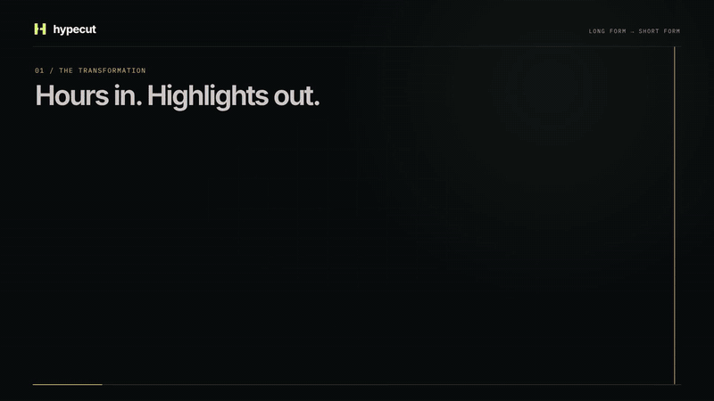

<div align="center">

# Hypecut

**Drop a link. Cut the good stuff.**

YouTube & Twitch → vertical highlights with animated, word-by-word captions.

```sh
hypecut "https://youtu.be/eHTXQW58WhA"
```

[](docs/demo/hypecut-product-720p.mp4)

**[Watch the product film · 32 seconds · 720p · 1.46 MB](docs/demo/hypecut-product-720p.mp4)**

[Watch the comedy clip](docs/demo/igl-clip-3.mp4) · [Watch the Tsoding / Twitch clip](docs/demo/godot-clip-1.mp4)

</div>

The preview includes both the comedy example and **Tsoding’s Godot / Twitch stream**.
The **435 kB preview** loads with the README; the full film loads when you click.
[Comedy source](https://www.youtube.com/watch?v=eHTXQW58WhA) · [Godot stream archive](https://www.youtube.com/watch?v=6CHkSG9NWoc).
Selections vary with the source, model, and framing options. The showcase used the
optional LR-ASD speaker tracker; the portable default uses face/mouth-motion tracking.

## Install

Requires **Python 3.11–3.13**, **FFmpeg with libass**, and an **Anthropic API key**
(or a Kimi key). Transcription and rendering run on your machine; the transcript
is sent to the selected provider to choose highlights. `--jury` also sends sampled frames.
API usage is billed by that provider. Whisper weights download on first use.

```sh
# macOS
brew install ffmpeg uv deno

# Ubuntu / Debian: install FFmpeg, then uv from https://docs.astral.sh/uv/
# sudo apt install ffmpeg
# YouTube also needs a supported JS runtime, such as Deno.

# Install directly from GitHub
uv tool install "git+https://github.com/pscyk/hypecut.git"

export ANTHROPIC_API_KEY="your-key"
hypecut doctor
hypecut "https://youtu.be/eHTXQW58WhA"
```

For a persistent key, copy `.env.example` to `~/.config/hypecut/.env` and fill it in.
An exported environment variable takes precedence over that file, then a `.env`
in the current directory. `HYPECUT_ENV_FILE` selects a different config file.
The command is installed in uv's tool bin directory; run `uv tool update-shell`
if it is not on your PATH. From a local checkout, use `uv tool install .`
or `pipx install .`.

**NVIDIA / Linux:** `uv tool install "hypecut[cuda] @ git+https://github.com/pscyk/hypecut.git"` includes the CUDA 12/cuDNN runtime
libraries. Hypecut detects a compatible GPU and probes NVENC before choosing it.
On macOS and machines without CUDA, it uses CPU transcription and `libx264`.
Force the CPU path with `--device cpu --encoder libx264`.

## One link in. Clips out.

```sh
# YouTube video, Short, or archived live video
hypecut "https://www.youtube.com/watch?v=eHTXQW58WhA"

# Twitch VOD or clip (replace with an accessible link)
hypecut "https://www.twitch.tv/videos/VIDEO_ID"
hypecut "https://clips.twitch.tv/CLIP_SLUG"

# Local video works too
hypecut interview.mp4

# Three tighter cuts with an editorial steer
hypecut interview.mp4 -n 3 --min 20 --max 45 --hint "the surprising founder stories"

# Quick pass; a smaller multilingual transcription model
hypecut interview.mp4 --fast

# Keep a streamer's corner webcam in frame
hypecut "https://www.twitch.tv/videos/VIDEO_ID" --reframe facecam

# Translate speech to English captions
hypecut interview.mp4 --translate --lang hi

# Visual reranking, using additional API calls
hypecut interview.mp4 --jury

# Scripts: one JSON result on stdout, progress on stderr
hypecut interview.mp4 --out ./exports --json > result.json
```

A normal run requests **5 highlights**, **15–60 seconds** each. A short source may
contain fewer good moments. Every run gets its own output directory, so previous
clips are preserved:

```text
hypecut-out/<video-title>-<run-id>/
├── clip_00.mp4       # 1080 × 1920, H.264 + AAC, burned-in captions
├── clip_00.srt       # editable sidecar subtitles
├── clip_01.mp4
├── clip_01.srt
├── transcript.json  # word timestamps for the source
└── manifest.json    # titles, source time ranges, output files, and any errors
```

Downloads and analysis are cached under `~/.cache/hypecut` (or `$XDG_CACHE_HOME/hypecut`).
Use `--cache-dir PATH` or `HYPECUT_CACHE_DIR` to relocate them. Changing the source,
model, language, hint, or duration limits creates a separate analysis cache.
An interrupted run keeps completed clips. Rerunning creates a fresh output folder
and reuses completed analysis; it does not resume partially rendered clips.

Exit status: **0** for a completed run, **1** for failure, partial renders, or no
usable speech/highlights, **2** for invalid arguments, **130** for interruption.
The manifest records requested, selected, and generated counts.

## Framing

| Option | Use it for |
| --- | --- |
| `track-fast` (default) | Face tracking using mouth-motion heuristics; no separate speaker model |
| `center` | A presenter already in the middle of the frame |
| `facecam` | A streamer with a small corner webcam |
| `stream` | Screen-aware framing; uses extra vision API calls |
| `track-corr` | Tracking based on face motion and audio-energy correlation |
| `track` | LR-ASD active-speaker tracking with an existing external setup |

For `track`, point `HYPECUT_ASD_DIR` at an LR-ASD checkout containing `asd_infer.py`
and `HYPECUT_ASD_PY` at its isolated Python interpreter. These are the existing
pipeline's external resources, not installed by the base package. Hypecut reports
a missing setup before downloading a video. See [architecture](docs/architecture.md).

## Troubleshooting

- **Missing key or FFmpeg:** run `hypecut doctor` and follow its diagnostic.
- **YouTube sign-in/challenge:** install Deno (or Node/Bun), update with
  `uv tool upgrade hypecut`, or pass `--cookies /path/to/cookies.txt` using your
  Netscape-format cookies file. Site restrictions can still prevent a download.
- **Twitch channel/live URL:** use a completed VOD or clip. Channels, playlists,
  and ongoing live streams are intentionally rejected.
- **GPU memory pressure:** use `--device cpu`, a smaller `--whisper` model, or
  `CLIPPER_WHISPER_COMPUTE=int8`. `--device` controls transcription;
  `--encoder` independently controls rendering.
- **Kimi:** set `KIMI_API_KEY`, then `--provider kimi --model YOUR_MODEL`.
  Standard keys use Moonshot's API. Coding-plan keys need the appropriate
  `KIMI_BASE_URL`; see `.env.example`.

## Develop

```sh
git clone https://github.com/pscyk/hypecut.git
cd hypecut
uv sync --locked
uv run pytest
uv run ruff check clipper tests
uv build
uv run hypecut --help
```

The product film’s [editable Remotion project](motion/README.md) is included.

The `clipper` Python namespace preserves the original engine; `hypecut` is the
public command. The default CLI never publishes to social platforms or starts
a web service. See [third-party notices](THIRD_PARTY_NOTICES.md) for bundled assets.
